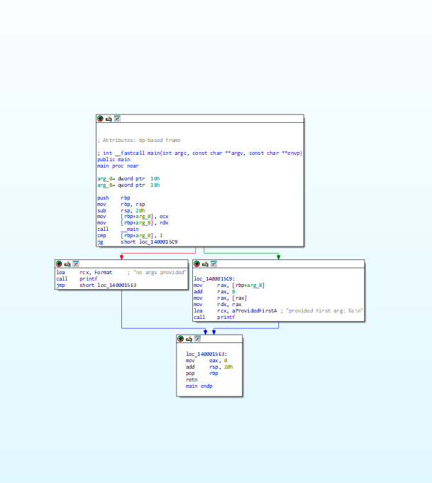
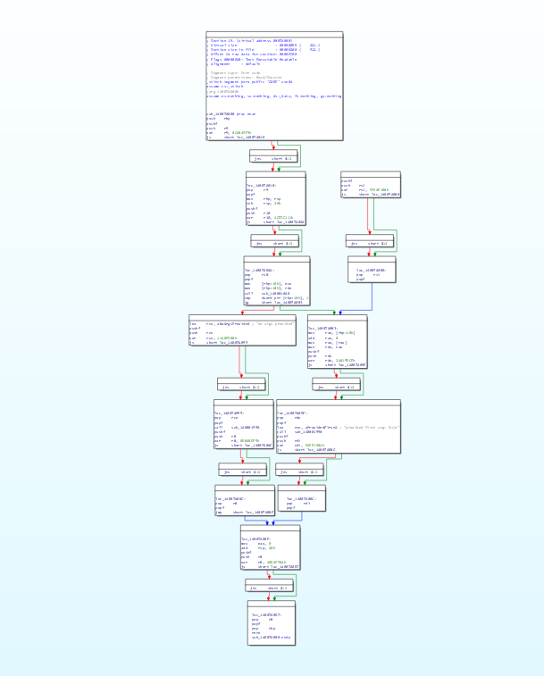

## Stitch
Cross-platform C++ library for patching and obfuscating code in compiled binaries.
Code and binary parsing are logically separated in order to support as many
binary format + architecture combinations as possible.

Stitch currently works with the following binary formats:
- PE

### Supported architectures

#### x86
Stitch's x86 capability is heavily built on top of [zasm](https://github.com/zyantific/zasm).
Each `X86Function` provides a `zasm::Assembler` instance that is pre-populated
with the original instructions as they were on disk. The original instructions can
be accessed with `X86Function::GetOriginalCode`, and their positions within the assembler
can be accessed with `X86Inst::GetPos`.

### Examples + Use Cases

#### Binary manipulation

Stitch allows for functions to be safely edited post-compilation. Operands for 
position-relative instructions, such as `jmp`s, are replaced with labels so that
the code can be easily modified and serialised without worry.

#### Obfuscation

The main and intended use for Stitch is code obfuscation on a binary level. It handles
the tedious task of injecting new data into files, so that operators can focus on more
complex obfuscation techniques, including but not limited to VM-based obfuscation.
Here's an example program that applies basic obfuscation (in the form of opaque predicates) 
to a function (specified by its absolute address).

```c++
#include "stitch/binary/pe.h"
#include "stitch/target/x86.h"

const std::vector regs = {
    zasm::x86::rdi,
    zasm::x86::rsi,
    zasm::x86::rcx,
    zasm::x86::rdx,
    zasm::x86::r8,
    zasm::x86::r9,
    zasm::x86::r10,
};

auto& getRandomReg() {
  auto& reg = regs[rand() % regs.size()];
  return reg;
}

int main() {
  srand(time(nullptr));
  stitch::PE pe("target/pe_branching.bin");
  auto* code = dynamic_cast<stitch::X86Code*>(pe.OpenCode());
  constexpr stitch::RVA fn_main = 0x00000001400015A1;
  auto& fn = dynamic_cast<stitch::X86Function&>(code->EditFunction(
      fn_main, ""));
  fn.Instrument([&fn](zasm::x86::Assembler& as) {
    for (stitch::X86Inst& inst : fn.GetOriginalCode()) {
      const bool to_insert = rand() % 2;
      const zasm::InstructionDetail& detail = inst.RawInst();
      if (detail.getMnemonic() != zasm::x86::Mnemonic::Ret && to_insert) {
        zasm::Label last_label = as.createLabel();
        const auto& reg = getRandomReg();
        as.setCursor(inst.GetPos());
        as.pushf();
        as.push(reg);
        as.xor_(reg, zasm::Imm(rand()));
        as.js(last_label);
        as.jns(last_label);
        as.bind(last_label);
        as.pop(reg);
        as.popf();
      }
    }
  });
  fn.Finish();
  pe.SaveAs("target/pe_opaque_predicates.bin");
  pe.Close();
}
```
Here's the function before the obfuscation is applied:



...and after:



#### What happened?

1. When the function address is supplied to `Code::EditFunction`, Stitch
begins parsing the code at that address, while also doing basic control
flow tracking by splitting it up into basic blocks
2. The code is parsed into a `zasm::x86::Assembler` instance and intra-function
references are replaced with labels
3. `X86Function::Instrument` allows us to modify the code, making use of
an assembler that has been populated with the original code
4. `X86Function::Finish` updates PE relocation info, assembles and writes the
code to a new section with a 16-byte alignment. The memory ranges previously 
occupied by the function are patched out and a jmp to the new code is inserted
in its place.
